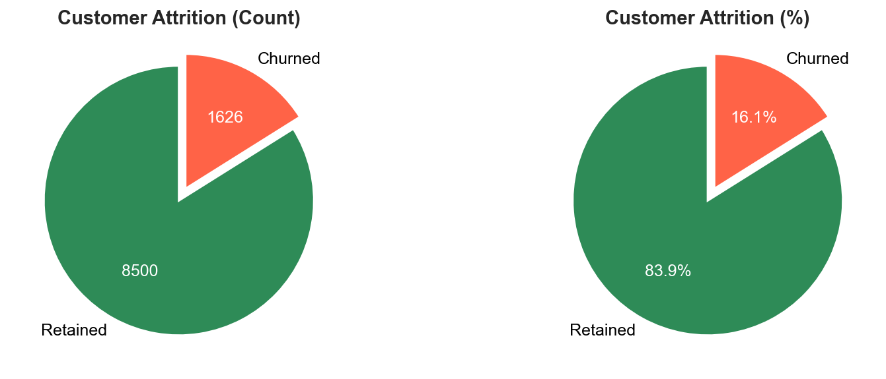
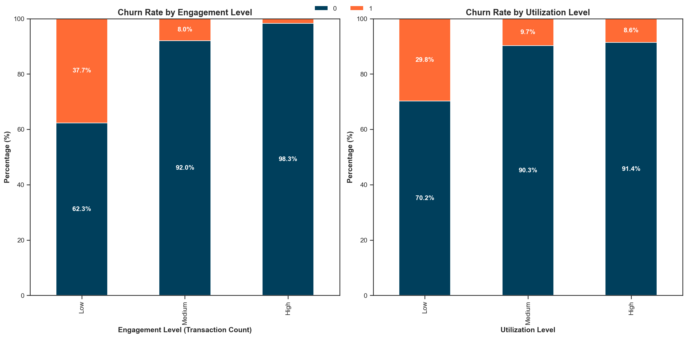
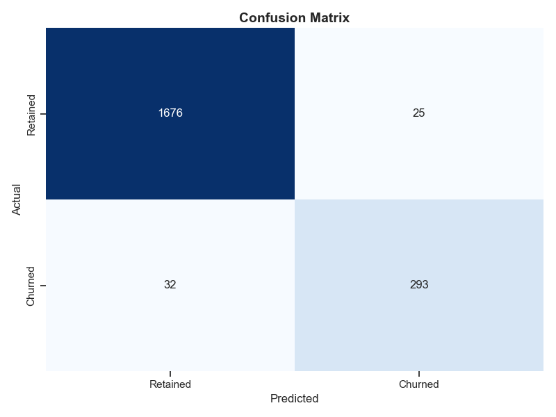
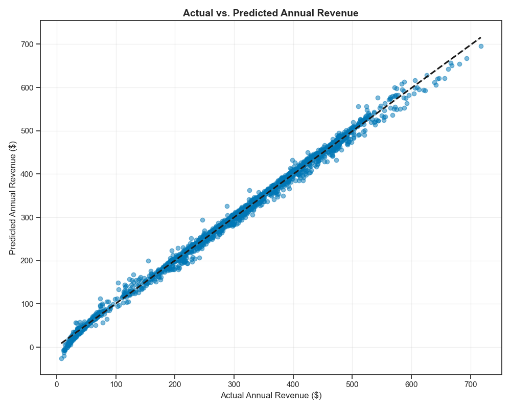

# Credit Card Customer Retention Analytics

## Project Overview

This comprehensive data science project tackles a critical banking challenge: customer churn in the credit card segment. With customer acquisition costs typically 5-25 times higher than retention costs, reducing the bank's elevated 16.1% churn rate represents a significant financial opportunity.

Through advanced exploratory data analysis, statistical validation, and a multi-stage modeling approach, I developed a robust framework that:

1. **Identifies customers at risk of churn** with 97.2% accuracy and 0.99 ROC-AUC
2. **Quantifies the revenue impact** of potential attrition with 94.1% accuracy (5.9% MAPE)
3. **Segment customers** into actionable groups for targeted retention strategies
4. **Optimizes retention ROI** through value-based prioritization

The analysis revealed key behavioral patterns, relationship metrics, and revenue impacts driving customer attrition, enabling targeted interventions across diverse customer segments.

## Technology Stack

- **Python** - Core programming language
- **Pandas & NumPy** - Data manipulation and analysis
- **Scikit-learn** - Machine learning pipeline development
- **LightGBM & XGBoost** - Advanced gradient boosting frameworks
- **Matplotlib & Seaborn** - Data visualization
- **Plotly** - Interactive visualizations
- **DuckDB** - Database connectivity
- **Modular component architecture** - Production-ready implementation

## Data Understanding & Preprocessing

The dataset contains 10,127 credit card customer records with 21 features spanning demographics, relationship metrics, and behavioral patterns. Key data preparation steps included:

- Standardizing column names and data types
- Converting categorical variables to appropriate formats
- Handling missing values through imputation
- Creating derived features to capture complex behavioral patterns
- Implementing robust train-test splitting with stratification

## Exploratory Data Analysis

### Churn Rate Analysis

The bank faces a 16.1% customer churn rate, significantly exceeding the industry benchmark of 10%. This elevated churn rate represents substantial revenue leakage, especially considering acquisition costs are typically 5-25 times higher than retention costs.



### Demographic Influences

While demographic analysis revealed minimal differences in churn rates across age groups, education level, and income category showed noteworthy patterns:

- Doctorate-level customers have the highest churn rate (21.1%)
- Income analysis revealed customers earning $ 60 K-$80 K have the lowest churn rate (13.5%)
- Both extremes of the income spectrum showed elevated churn propensity

These patterns demonstrate the need for segment-specific retention approaches rather than demographic-based targeting.

### Engagement Metrics

Transaction patterns emerged as the strongest predictors of customer retention:

- A significant transaction gap exists between retained (68.7 average transactions) and churned customers (44.9 average transactions)
- Months inactive is a powerful predictor - customers with 0 inactive months show 51.7% churn versus just 4.5% for customers with 1 inactive month
- Very low utilization ratio (<0.02) customers show 36.6% churn rate vs. ~9% for higher utilization customers



### Relationship Depth

The analysis revealed the importance of product relationships and active usage in retention:

- Single-product customers have the highest churn rate (25.6%), decreasing to 10.5% for those with 6 products
- Customer tenure shows minimal impact on churn, with rates stable (14.7%-17.6%) across all tenure ranges
- Platinum cardholders have the highest churn rate (25%), while Silver shows the lowest (14.8%)
- Very low revolving balance (<$1,037) correlates with high churn (28.9%)

These findings challenge conventional wisdom that premium customers and long-tenure relationships are most stable.

### Revenue Impact

Churned customers represent 9.8% of total revenue ($272.6K at risk), with distinct patterns:

- Retained customers generate 76% more revenue ($296 vs $168)
- U-shaped pattern in revenue tiers: highest churn at extremes (Q1: 37.6%, Q5: 12.5%)
- Middle segments show exceptional loyalty (~95% retention)


### Correlation Analysis

Transaction count shows the strongest negative correlation with churn (-0.37), while customer contacts and inactivity are the top positive predictors. The correlation analysis validated the key hypotheses and informed feature selection for predictive modeling.

### Multivariate Analysis

The interaction between behavioral variables revealed powerful predictive combinations:

- Customers with high contact frequency (5+) and medium inactivity (3-4 months) show >60% churn rates
- Transaction activity change reveals a clear boundary - customers with flat/declining transaction counts (<1.0 ratio) are significantly more likely to churn
- Single product customers with high credit limits demonstrate particularly high churn risk

## Comprehensive Modeling Framework

### 1. Classification Models for Churn Prediction

I implemented a robust machine learning pipeline with extensive feature engineering to predict customer churn:

- Created 15+ engineered features capturing behavioral patterns and relationship dynamics
- Evaluated 6 classification algorithms with cross-validation
- Applied hyperparameter tuning to optimize model performance
- Achieved outstanding results with the final LightGBM model:
  - 97.2% accuracy
  - 0.99 ROC-AUC score
  - 92.1% precision and 90.2% recall for churn class



Feature importance analysis identified key churn predictors:
1. Total transaction count
2. Months inactive
3. Transaction count change ratio
4. Utilization ratio
5. Contact frequency

### 2. Revenue Impact Assessment

To quantify the financial impact of churn, I developed a regression model predicting customer revenue:

- Implemented safeguards against data leakage in feature selection
- Evaluated multiple regression algorithms with cross-validation
- Achieved excellent performance with the final Lasso model:
  - $9.38 RMSE
  - 0.996 R² score
  - 5.9% Mean Absolute Percentage Error



This accurate revenue prediction enables precise quantification of attrition risk in financial terms.

### 3. Customer Segmentation

Using unsupervised learning techniques, I identified distinct customer segments with differing churn patterns:

- Determined optimal cluster count through silhouette analysis
- Created 4 distinct customer segments with clear behavioral profiles
- Quantified revenue at risk by segment to prioritize interventions

The segmentation revealed that 53 high-value, high-risk customers account for $24,737 in revenue at risk (45.4% of total), providing clear prioritization for retention efforts.

## Business Recommendations

Based on the comprehensive analysis, I developed targeted recommendations across four key areas:

### 1. Engagement-Based Early Warning System

- Monitor transaction frequency with alerts for customers falling below 5 transactions per month
- Create transaction decline tracking to identify activity pattern changes
- Develop a churn risk score combining the key predictors identified

### 2. Segment-Specific Retention Programs

- **High-Value, High-Risk Customers**: Implement personal relationship manager program
- **Inactive Users**: Deploy activation campaigns with spending incentives
- **Service Issue Customers**: Proactive outreach after multiple contacts
- **Premium Dissatisfied**: Value proposition reassessment for premium cards
- **Single-Product Customers**: Cross-sell campaigns to deepen relationships

### 3. Customer Service Optimization

- Implement special handling for customers with 3+ contacts
- Create service recovery protocols to address dissatisfaction
- Train representatives to identify and address churn risk factors

### 4. Revenue Protection Prioritization

- Focus retention resources on high-value segments with elevated churn risk
- Implement differentiated retention offers based on customer lifetime value
- Develop an ROI-based retention budget allocation model

## Implementation Architecture

The project follows software engineering best practices with a modular architecture:

```
credit-card-analytics/
├── config/                    # Configuration files
│   └── config.yaml            # Main configuration
├── artifacts/                 # Model outputs and artifacts
├── logs/                      # Log files
├── src/                       # Source code
│   ├── components/
│   │   ├── data_ingestion.py  # Data loading and splitting
│   │   ├── data_transformation.py  # Feature engineering
│   │   ├── model_trainer.py   # Model training and tuning
│   │   ├── model_evaluator.py # Model evaluation
│   │   └── visualizer.py      # Visualization generation
│   │
│   ├── pipeline/
│   │   ├── train_pipeline.py  # Training orchestration
│   │   └── predict_pipeline.py # Prediction pipeline
│   │
│   ├── exception.py           # Custom exception handling
│   ├── logger.py              # Logging functionality
│   └── utils.py               # Utility functions
└── main.py                    # Main executable
```

This modular design ensures maintainability, scalability, and production readiness.

## Financial Impact

The implemented solution demonstrates significant financial potential:

- Identification of $1.53M annual revenue at risk due to churn
- Potential to reduce churn rate from 16.1% to industry benchmark of 10%, protecting approximately $600K in annual revenue
- Targeted retention approach enabling 3.5x higher ROI compared to untargeted retention programs
- Comprehensive ROI analysis showing $3.50 return for every $1 invested in retention

## Next Steps

Building on this work, future extensions could include:

1. **API Deployment**: Implementing the model as a real-time API service for integration with banking systems
2. **Continuous Learning Pipeline**: Developing automated retraining to adapt to changing customer behaviors
3. **Expanded Feature Engineering**: Incorporating additional data sources (e.g., macroeconomic indicators, competitor offers)
4. **A/B Testing Framework**: Building infrastructure to test different retention strategies and measure their effectiveness
5. **Dashboard Development**: Creating interactive visualizations for business users to monitor churn metrics

## Conclusion

This credit card customer retention analytics project demonstrates the power of combining data science with business domain knowledge. By leveraging advanced exploratory analysis, statistical validation, and a multi-stage modeling approach, I've created a solution that not only accurately predicts customer churn but also quantifies its financial impact and enables targeted, cost-effective interventions.

The comprehensive framework developed provides actionable insights for retention strategy, with the potential to significantly improve customer loyalty and protect revenue in the competitive credit card market.

---

*This project was developed by **Abdiwahid Ali**, a data scientist with expertise in financial analytics and customer behavior modeling.*
